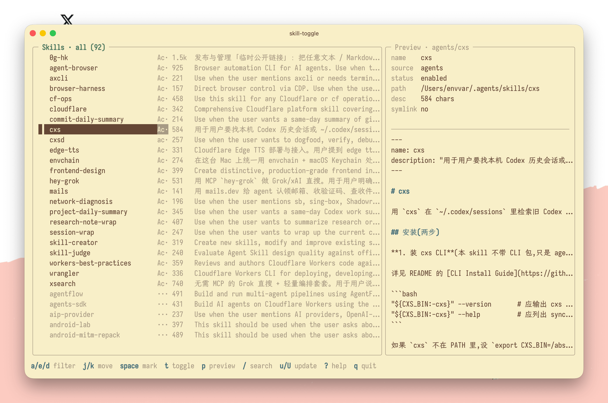
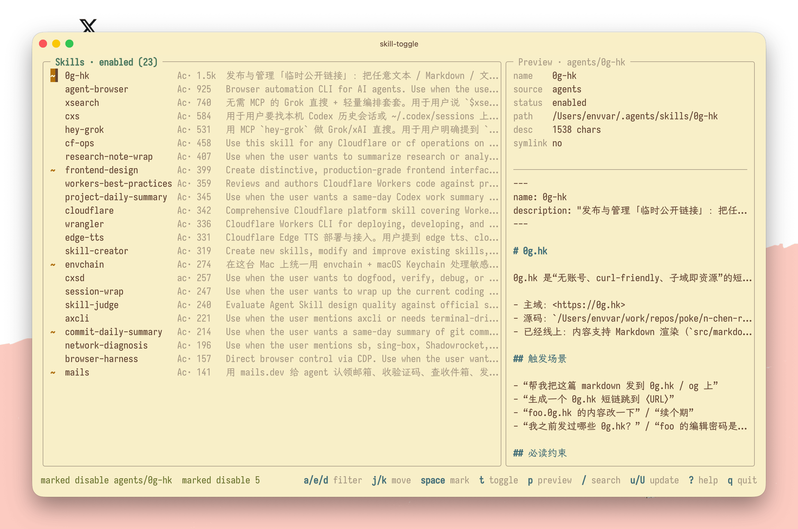
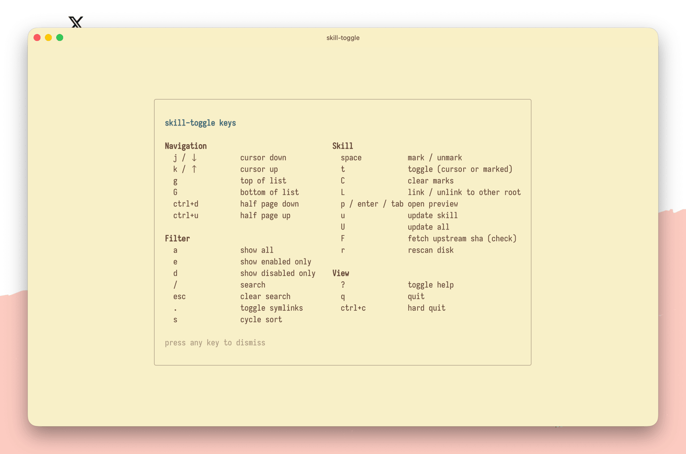

# skill-toggle

[English](README.md)

**三套 skill，一个开关台。**

`skill-toggle` 把 Agents、Claude、Codex 的本地 skills 聚到一个 TUI：开关、更新、搜索、预览、跨 root 软连接，都在同一屏完成。

用 `Space` 标记批量操作，`t` 应用；用 `L` 把一个真实 skill 安全暴露给其他 root，不复制、不误删。

## 截图

### 主界面



### 过滤技能



### 帮助面板



## 亮点

- 一个 TUI 管理 Agents、Claude、Codex 三套 skill 根目录，不需要切 profile。
- 默认识别软连接 root：如果某个 source root 指向另一个 root，会隐藏重复行；用 `.` 或 `--show-linked` 可以展开所有来源。
- 支持单 skill 软连接：按 `L` 可以把一个真实 skill 目录以 symlink 形式暴露到其他 root，也可以只移除已有 symlink。
- 安全切换：启用/禁用走 `os.Rename`，拒绝覆盖目标，并保护 `.system`。
- 托管更新保护：读取 `.skill-lock.json`，对手工放置的 skill 拒绝单独更新，避免误交给 `npx skills update`。
- 上游新鲜度检查：按 `F` 只检查托管 skill 是否落后于上游 hash，不安装更新。
- 快速收窄列表：`a` / `e` / `d` 过滤、文本搜索、按描述长度排序、内嵌/全屏 SKILL.md 预览。
- CLI 可脚本化：支持列表、过滤、启用、禁用和更新。

## 功能概览

- 聚合三个 live roots，不需要先选择 profile。
- Lazygit 风格 TUI：左侧是单列表，支持 `a`（全部）/ `e`（启用）/ `d`（禁用）过滤；右侧预览 SKILL.md。
- 用 `Space` 标记多个切换操作，再用 `t` 一次应用；没有标记时，`t` 会立即切换当前行。
- 用 `L` 把启用状态的 skill link / unlink 到其他 root，使用 symlink 而不是复制目录。
- 支持按名称、来源、描述搜索。
- 支持按名称、描述长度降序、描述长度升序排序。
- 对托管 skill 运行 `npx skills update`，支持单个 skill 或全局批量更新。
- 可以只检查托管 skill 的上游新鲜度，不安装任何更新。
- 避免删除：切换只会 rename / move 目录或 symlink。

## 安装

从本地 checkout 构建：

```bash
make build
install -m 755 ./skill-toggle ~/.local/bin/skill-toggle
```

或者使用 `go install`：

```bash
go install github.com/catoncat/skill-toggle/cmd/skill-toggle@latest
```

需要较新的 Go 工具链构建（1.22+；当前 module pin 到 1.26.1）。

## 使用

打开 TUI：

```bash
skill-toggle
```

常用按键：

```text
a / e / d          过滤列表（全部 / 仅启用 / 仅禁用）
j/k or ↑/↓         移动光标
g / G              跳到列表顶部 / 底部
ctrl+d / ctrl+u    下翻 / 上翻半页
space              标记 / 取消标记当前 skill
t                  切换当前 skill，或应用已标记操作
C                  清空已标记操作
L                  link / unlink 当前 skill 到其他 root
p / enter / tab    全屏 SKILL.md 预览（切换）
/                  搜索（匹配名称、来源、描述）
esc                清空搜索 / 关闭消息
.                  显示或隐藏 symlink 重复行
s                  切换排序（name → size↓ → size↑）
u                  更新当前已启用 skill（实时进度覆盖层）
U                  更新所有全局 skills（实时进度覆盖层）
F                  获取当前 skill 的上游 sha（只检查，不安装）
r                  重新扫描文件系统
?                  帮助面板
q                  退出（如果有已标记操作会确认）
ctrl+c             强制退出
```

更新进度覆盖层（modeUpdate）中：

```text
j/k or ↑/↓         上下滚动输出
g / G              跳到顶部 / 底部（最新行）
esc / q            取消并关闭（如果 npx 仍在运行，会杀掉进程）
```

非交互命令：

```bash
skill-toggle list
skill-toggle list --source agents
skill-toggle list --status enabled --sort desc-size-desc --limit 20
skill-toggle list --show-linked              # 包含 symlink 重复行
skill-toggle enable cloudflare-global
skill-toggle disable ctf-web --source claude
skill-toggle update cloudflare-global
skill-toggle update --all
```

只有当同名 skill 同时存在于两个或更多 source 时，`enable` / `disable` 才需要 `--source`。如果名称在所有 source 中唯一，可以省略。

### Symlink source roots

如果 `~/.claude/skills` 是指向 `~/.agents/skills` 的 symlink（常见配置），同一个 skill 原本会显示两次：一次 agents，一次 claude。默认情况下，工具会解析 canonical path 并隐藏重复行，按固定顺序锚定到最早的 source（agents → claude → codex）。

使用 CLI 的 `--show-linked` 或 TUI 里的 `.` 可以显示每个 source 的行；CLI 输出里 symlink 行会用 `@` 标记。

### 单 skill symlink

在启用状态的 skill 上按 `L`，可以把它 link / unlink 到其他 sibling roots。缺失的 sibling root 会成为 link 候选：工具会创建 `<target-root>/<name>` symlink，指向当前真实 skill 目录。已经是 symlink 的 sibling 会成为 unlink 候选：工具只移除 symlink，不会碰真实目录。

这个流程会拒绝 disabled 行、`.system` 等受保护名称、已有目标、缺少 `SKILL.md` 的来源，以及任何尝试 unlink 真实目录的操作。如果有多个目标，确认栏会使用来源字母（`a` / `c` / `x`）并提供数字兜底。

### 托管 skill 与手工放置 skill

`npx skills update` 只知道如何刷新它自己安装的 skill。权威标记是 `~/.<source>/.skill-lock.json`：在该文件 `skills.<name>` 下出现的条目，才是通过 `npx skills add` 加入的。你手写或从其他机器复制来的 SKILL.md 目录不会在 lockfile 中，因此不能交给工具自动更新。

`skill-toggle` 扫描时会读取每个 source 的 lockfile，并给每个 skill 标记 `Managed`。TUI 中的 `u` 和 CLI 的 `skill-toggle update NAME` 都会拒绝更新 unmanaged skill，并显示 `manual update only`。批量路径（`U` / `skill-toggle update --all`）会直接委托给 `npx skills update -g`；vercel-labs/skills 本身只会触碰它托管的条目。

## 文件系统模型

Live skill roots：

```text
~/.agents/skills/<name>/SKILL.md
~/.claude/skills/<name>/SKILL.md
~/.codex/skills/<name>/SKILL.md
```

禁用后的 skill 会进入一个全局 off 目录，并按 source 分区，这样工具能把它移动回正确的 root：

```text
~/.config/skill-toggle/off/<source>/<name>/SKILL.md
```

Toggle 始终是在 live root 和 off path 之间做 `os.Rename`。工具会拒绝覆盖已有目标，也会拒绝受保护名称（`.system`）。

`SKILL_TOGGLE_OFF_ROOT` 和 `SKILL_TOGGLE_CONFIG_DIR` 主要用于测试和隔离环境。

## 从旧 profile 布局迁移

早期版本把禁用 skill 存在按 profile 分开的路径下：

```text
~/.config/toggle-skills/off/agents/<name>
~/.config/toggle-skills/off/claude/<name>
~/.config/toggle-skills/off/codex/<name>
~/.<source>/skills-disabled/<name>
```

这些目录仍会以只读方式扫描；放在里面的内容会显示在 Disabled 面板中。新禁用的 skill 会写入新布局（`~/.config/skill-toggle/off/<source>/<name>`）。准备好后，可以手动迁移：

```bash
mkdir -p ~/.config/skill-toggle/off
for src in agents claude codex; do
  if [ -d ~/.config/toggle-skills/off/$src ]; then
    mv ~/.config/toggle-skills/off/$src ~/.config/skill-toggle/off/
  fi
done
```

工具不会主动删除或重写旧目录。

## Codex / Claude 注意事项

Codex 和 Claude 会在 session 启动时读取 skill，并缓存当前可见的 skill metadata。切换 skill 后，需要打开新 session 才能看到更新后的列表和上下文预算变化。

这个工具只管理基于文件夹的用户 skills。插件提供的 skills 和内置系统 skills 由 Codex / Claude 配置控制，不应该通过移动 live roots 外的文件夹来管理。

## 开发

```bash
make build      # 构建二进制
make test       # go test ./...
make vet        # go vet ./...
make run        # 构建并针对你的 live roots 运行 TUI
```

重写设计说明见：
`docs/superpowers/specs/2026-04-27-tui-redesign-aggregated-lazygit.md`。
